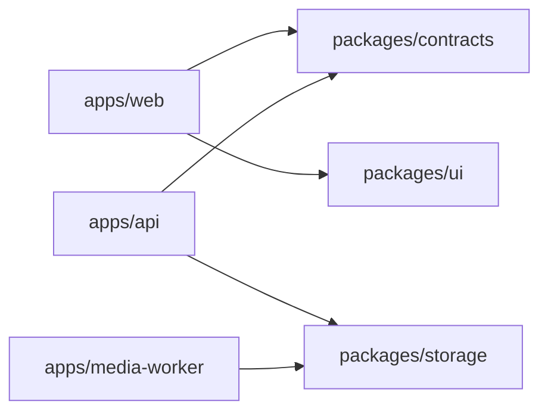
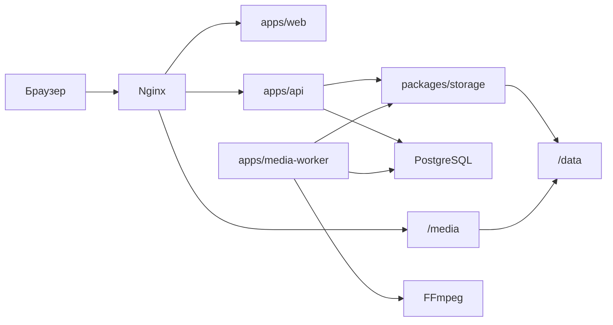
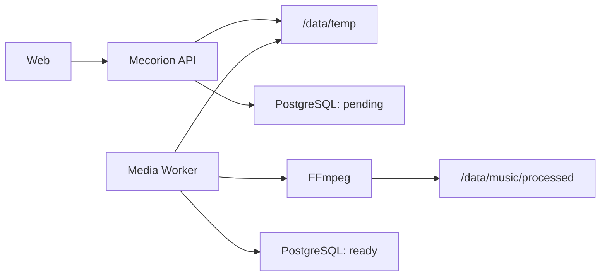
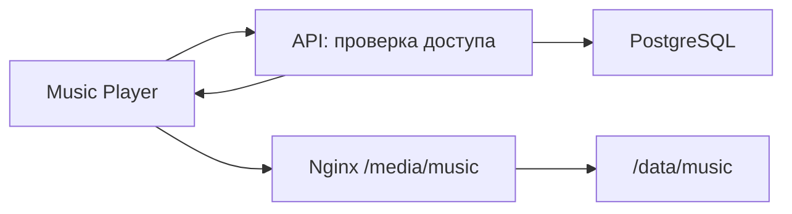

# Архитектура Mecorion

## 1. Общая идея

Mecorion развивается как монорепозиторий: frontend, единый API, обработка
медиафайлов и конфигурация окружения находятся в одном Git-репозитории.

На первом этапе используется модульный монолит:

- один frontend;
- один Mecorion API;
- один Media Worker;
- одна PostgreSQL;
- локальная директория `/data` вместо настоящего S3;
- отдельные модули для Music, Video, Books, Cloud, Mail, VPN и других сервисов.

Модульный монолит проще разрабатывать и запускать, чем набор микросервисов, но
границы модулей позволяют позднее вынести нагруженные части в отдельные
приложения.

## 2. Структура репозитория

```text
mecorion/
├── apps/
│   ├── web/                  # Frontend всей экосистемы Mecorion
│   ├── api/                  # Единый HTTP API
│   └── media-worker/         # FFmpeg и фоновая обработка файлов
│
├── packages/
│   ├── contracts/            # Общие контракты запросов и ответов API
│   ├── storage/              # Единый интерфейс локального диска и S3
│   ├── ui/                   # Общий UI только при появлении нескольких web-приложений
│   └── config/               # Общие настройки инструментов, когда они понадобятся
│
├── data/
│   ├── music/
│   ├── video/
│   ├── books/
│   ├── cloud/
│   └── temp/
│
├── infrastructure/
│   ├── nginx/
│   ├── postgres/
│   ├── monitoring/
│   └── docker-compose.yml
│
├── docs/
│   └── architecture/
│
└── package.json
```

## 3. Разница между `apps` и `packages`

### `apps`

В `apps` находятся программы, которые можно запустить как отдельный процесс.

Примеры:

- `apps/web` запускается через Vite и собирается в HTML, CSS и JavaScript;
- `apps/api` запускает HTTP-сервер;
- `apps/media-worker` запускает процесс, ожидающий задания обработки файлов.

Каждое приложение имеет точку входа, собственные переменные окружения и
команды `dev`, `build` и `start`.

### `packages`

В `packages` находятся внутренние библиотеки. Они не открывают порт, не имеют
собственной базы и не запускаются самостоятельно. Их импортируют приложения.



Правило зависимостей:

- приложения могут импортировать packages;
- packages не должны импортировать код из apps;
- модули не должны образовывать циклические зависимости.

Не нужно выносить код в `packages` заранее. Библиотека создаётся только тогда,
когда один и тот же код действительно нужен нескольким приложениям.

## 4. `packages/contracts`

Contracts описывает публичный язык общения frontend и API:

- структуру HTTP-запросов;
- структуру HTTP-ответов;
- допустимые значения;
- коды ошибок;
- схемы Zod;
- TypeScript-типы, полученные из этих схем.

Пример:

```ts
import {z} from "zod";

export const TrackSchema = z.object({
  id: z.string().uuid(),
  title: z.string(),
  artist: z.string(),
  durationMs: z.number().int().positive(),
});

export type Track = z.infer<typeof TrackSchema>;
```

API использует схему для проверки ответа, а frontend — для типизации
полученных данных. Благодаря этому поле не может незаметно называться
`durationMs` на сервере и `duration` на клиенте.

В contracts нельзя помещать:

- SQL-запросы;
- таблицы PostgreSQL;
- внутренние модели базы;
- бизнес-логику;
- секретные настройки.

Контракт описывает только то, что разрешено передавать через границу API.

## 5. `packages/storage`

Storage — это не отдельный сервер и не хранилище файлов. Это библиотека с
единым программным интерфейсом для работы с файлами.

Она нужна одновременно двум приложениям:

- API сохраняет загруженный оригинал;
- Media Worker читает оригинал и записывает обработанный файл.

```ts
interface Storage {
  put(key: string, data: Readable): Promise<void>;
  read(key: string): Promise<Readable>;
  delete(key: string): Promise<void>;
  exists(key: string): Promise<boolean>;
  getUrl(key: string): Promise<string>;
}
```

Первая реализация работает с локальной директорией:

```text
LocalStorage → /data/music/originals/track-id/source.flac
```

Будущая реализация использует S3:

```text
S3Storage → s3://mecorion-music/originals/track-id/source.flac
```

API и Media Worker работают с интерфейсом `Storage` и не знают, используется
ли обычный диск или S3. При переезде на S3 изменятся реализация и переменные
окружения, но не музыкальная бизнес-логика.

В PostgreSQL хранится только ключ объекта:

```text
music/processed/track-id/audio-320.mp3
```

Абсолютный путь `/data/...` и адрес конкретного сервера сохранять в таблице не
нужно.

## 6. `packages/ui`

UI содержит визуальные компоненты, используемые несколькими frontend-
приложениями:

- кнопки;
- поля форм;
- модальные окна;
- таблицы;
- токены цветов и размеров;
- базовую типографику Mecorion.

Если у Mecorion пока одно приложение `apps/web`, компоненты разумнее держать
внутри него:

```text
apps/web/src/components/ui
```

Перенос в `packages/ui` понадобится, когда появится второе frontend-приложение,
например отдельная административная панель или desktop-клиент. Выносить туда
страницы Music, Video или Books нельзя: это компоненты конкретных продуктов, а
не общий UI kit.

## 7. `packages/config`

Config предназначен для общих настроек инструментов разработки:

- базового `tsconfig`;
- правил ESLint;
- конфигурации Prettier;
- общей конфигурации тестов.

Например, `apps/api` и `apps/media-worker` могут расширять один базовый
TypeScript-конфиг вместо копирования двадцати одинаковых параметров.

Здесь не должны храниться runtime-настройки и секреты. `DATABASE_URL`, пароли,
S3-ключи и адреса серверов остаются в `.env` каждого приложения.

На текущем этапе `packages/config` необязателен. Его следует создать после
появления повторяющихся конфигураций.

## 8. Единый Mecorion API

Текущий backend находится в `apps/api` и должен развиваться как единый API.

```text
apps/api/src/
├── core/
│   ├── auth/
│   ├── config/
│   ├── database/
│   ├── errors/
│   └── http/
│
├── modules/
│   ├── identity/
│   ├── admin/
│   ├── music/
│   ├── video/
│   ├── books/
│   ├── cloud/
│   ├── mail/
│   └── vpn/
│
├── shared/
└── main.ts
```

Каждый доменный модуль имеет одинаковое внутреннее устройство:

```text
modules/music/
├── music.routes.ts       # HTTP-маршруты
├── music.service.ts      # Правила и сценарии Music
├── music.repository.ts   # SQL-запросы Music
├── music.schemas.ts      # Валидация входных данных
├── music.types.ts        # Внутренние типы
└── music.module.ts       # Регистрация модуля
```

Пример маршрутов:

```text
GET /api/v1/music/tracks
GET /api/v1/books/catalog
GET /api/v1/video/movies
GET /api/v1/admin/users
```

Модуль Music не обращается напрямую к таблицам Books или VPN. Общего
пользователя предоставляет модуль Identity.

## 9. PostgreSQL

Используется один экземпляр PostgreSQL, но таблицы разделяются схемами:

```text
identity.users
identity.sessions
admin.audit_log

music.tracks
music.albums
music.playlists

video.videos
video.collections

books.books
books.authors

cloud.files
mail.accounts
vpn.devices
```

Такое разделение сохраняет понятные границы внутри одной базы и облегчает
возможный перенос модуля на отдельный сервер.

## 10. Локальное файловое хранилище

На первом этапе директория `data` эмулирует объектное хранилище:

```text
data/
├── music/
│   ├── originals/{trackId}/source.flac
│   ├── processed/{trackId}/audio-320.mp3
│   ├── processed/{trackId}/audio-128.mp3
│   └── covers/{albumId}/cover.webp
│
├── video/
│   ├── originals/{videoId}/source.mkv
│   ├── streams/{videoId}/master.m3u8
│   └── covers/{videoId}/poster.webp
│
├── books/
│   ├── originals/{bookId}/book.epub
│   └── covers/{bookId}/cover.webp
│
├── cloud/
└── temp/
```

Имена файлов строятся на UUID, а не на названиях произведений. Это исключает
конфликты имён, проблемы с кодировками и большую часть ошибок с путями.

Содержимое `data` не должно попадать в Git. В репозитории можно оставить
только `data/README.md` и пустые `.gitkeep`.

## 11. Infrastructure

`infrastructure` содержит настройки окружения, а не код Music, Books или
другого продукта.

- `nginx` направляет `/api` в API и отдаёт `/media` из `/data`;
- `postgres` содержит параметры инициализации базы;
- `docker-compose.yml` запускает компоненты одной командой;
- `monitoring` в будущем содержит Prometheus, Grafana и сбор логов.

```text
/                 → frontend
/api/*            → Mecorion API
/media/music/*    → /data/music/*
/media/video/*    → /data/video/*
```

## 12. Общая схема



## 13. Загрузка и обработка файла



Порядок работы:

1. Frontend загружает файл через API.
2. API сохраняет оригинал и создаёт задание со статусом `pending`.
3. Media Worker получает задание.
4. FFmpeg анализирует и преобразует файл.
5. Worker сохраняет подготовленные версии.
6. Запись в PostgreSQL получает статус `ready`.

Сначала очередь заданий можно реализовать таблицей PostgreSQL. Redis и BullMQ
следует добавлять только при появлении реальной нагрузки.

## 14. Воспроизведение файла



API проверяет пользователя и возвращает URL медиафайла. Сам файл передаёт
Nginx, а не Node.js API. Это снижает нагрузку на API и позволяет корректно
обрабатывать Range-запросы для перемотки аудио и видео.

## 15. Дополнительные компоненты

- централизованная авторизация в модуле Identity;
- аудит административных действий;
- ограничения размера и формата загрузок;
- защита путей от `../` и выхода за пределы `/data`;
- резервное копирование PostgreSQL и `/data`;
- очередь фоновых заданий;
- журналирование API и Media Worker;
- квоты хранилища пользователей;
- антивирусная проверка файлов Cloud;
- health-check каждого запускаемого приложения;
- integration-тесты API с отдельной тестовой базой.

## 16. Порядок перестройки текущего проекта

1. Перенести существующий frontend в `apps/web`.
2. Поддерживать единый backend в `apps/api`.
3. Разделить API на `core` и `modules/music`.
4. Создать локальную директорию `data` и добавить её содержимое в `.gitignore`.
5. Создать `packages/storage` с реализацией `LocalStorage`.
6. Создать `packages/contracts` после подключения frontend к API.
7. Создать `apps/media-worker`.
8. Подключить Nginx для маршрутов `/api` и `/media`.
9. Реализовать полный цикл загрузки одного музыкального файла.
10. Использовать тот же подход для Video и Books.
